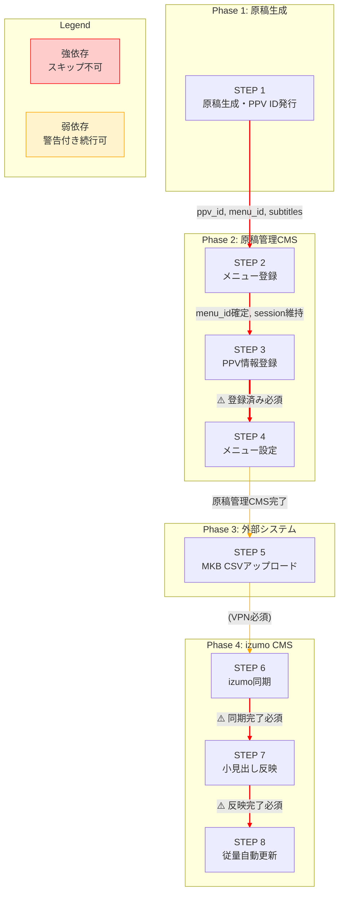
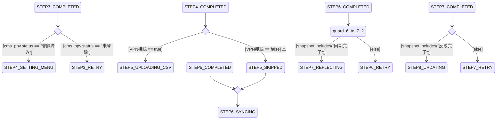
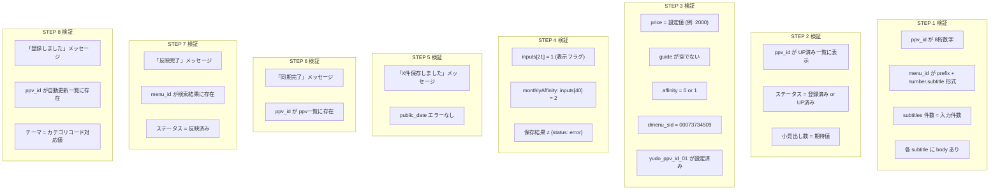
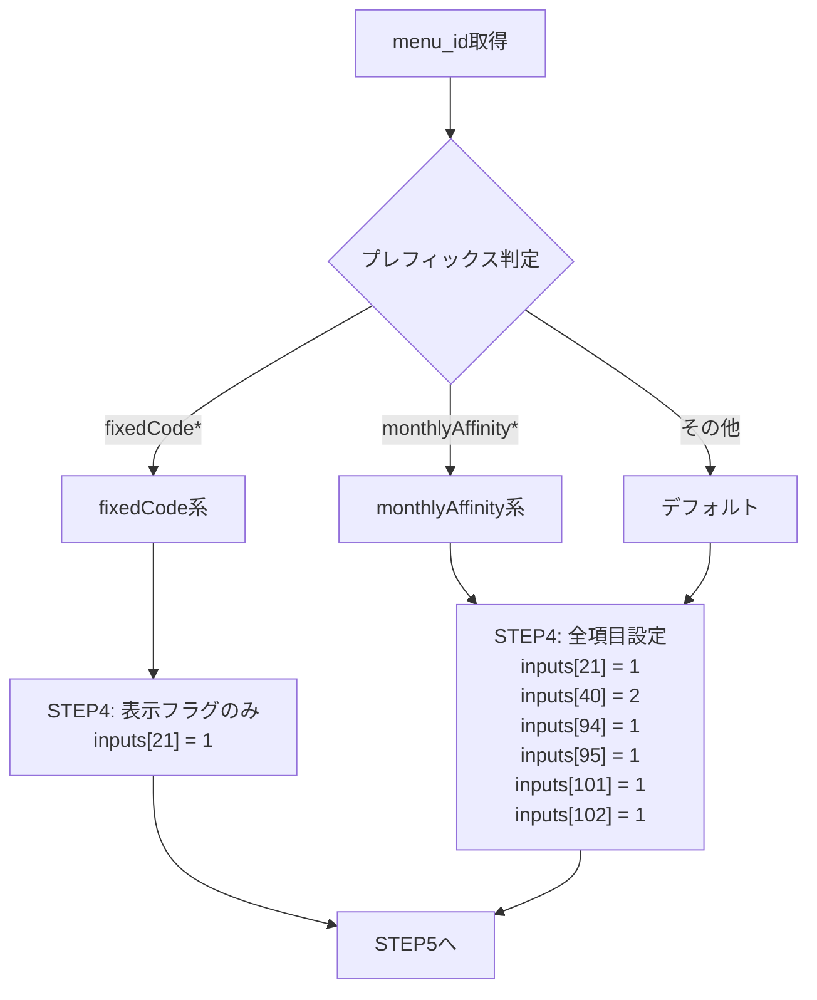
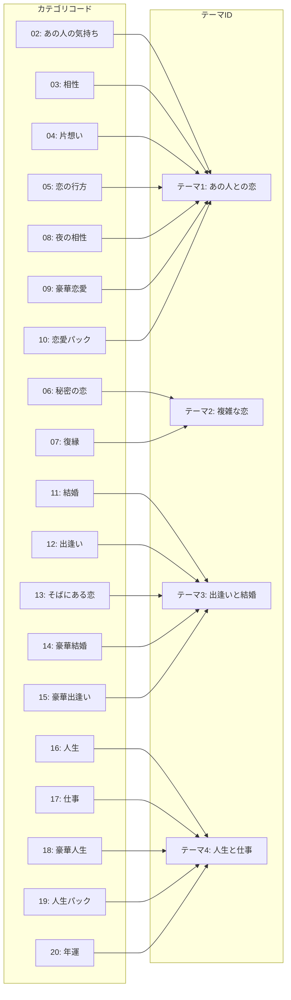

# 商品登録ワークフロー ステートマシン図

## 目的

1. **全パスの洗い出し**: 正常パス・エラーパス・スキップパスを明確化
2. **システムレベルの整合性チェック**: 依存関係の可視化と検証
3. **設計品質向上**: コード実装前の仕様確定

---

## 1. メインステートマシン（全体フロー）

```mermaid
stateDiagram-v2
    [*] --> IDLE

    IDLE --> STEP1_GENERATING: start_registration(input_data)

    state "STEP 1: 原稿生成" as STEP1_GENERATING {
        [*] --> Generating
        Generating --> ValidatingResult
        ValidatingResult --> [*]: ppv_id & menu_id OK
        ValidatingResult --> Generating: retry (max 3)
    }

    STEP1_GENERATING --> STEP1_COMPLETED: success
    STEP1_GENERATING --> STEP1_FAILED: max_retry_exceeded

    STEP1_COMPLETED --> STEP2_REGISTERING: ppv_id, menu_id, subtitles

    state "STEP 2: メニュー登録" as STEP2_REGISTERING {
        [*] --> LoginCMS
        LoginCMS --> SelectSite
        SelectSite --> InputManuscript
        InputManuscript --> UploadManuscript
        UploadManuscript --> VerifyUpload
        VerifyUpload --> [*]: ppv_id in UP済み一覧
    }

    STEP2_REGISTERING --> STEP2_COMPLETED: success
    STEP2_REGISTERING --> STEP2_FAILED: error

    STEP2_COMPLETED --> STEP3_SETTING_PPV: menu_id, session

    state "STEP 3: PPV情報登録" as STEP3_SETTING_PPV {
        [*] --> NavigateCmsPpv
        NavigateCmsPpv --> InputPriceGuide
        InputPriceGuide --> InputCarrierValues
        InputCarrierValues --> InputYudoSettings
        InputYudoSettings --> SavePpvInfo
        SavePpvInfo --> VerifyPpvSaved
        VerifyPpvSaved --> [*]: status = 登録済み
    }

    STEP3_SETTING_PPV --> STEP3_COMPLETED: success
    STEP3_SETTING_PPV --> STEP3_FAILED: error

    note right of STEP3_COMPLETED
        ⚠️ 重要: STEP3完了が
        STEP4実行の前提条件
    end note

    STEP3_COMPLETED --> STEP4_SETTING_MENU: [STEP3 = 登録済み]

    state "STEP 4: メニュー設定" as STEP4_SETTING_MENU {
        [*] --> NavigateCmsMenu
        NavigateCmsMenu --> DeterminePrefix
        DeterminePrefix --> SetDisplayFlag: all prefixes
        SetDisplayFlag --> SetStrokeCount: monthlyAffinity only
        SetDisplayFlag --> SaveMenuSettings: fixedCode only
        SetStrokeCount --> SetZokkanSettings
        SetZokkanSettings --> SaveMenuSettings
        SaveMenuSettings --> VerifyMenuSaved
        VerifyMenuSaved --> [*]: inputs[21] = 1
    }

    STEP4_SETTING_MENU --> STEP4_COMPLETED: success
    STEP4_SETTING_MENU --> STEP4_FAILED: error (STEP3未完了の可能性)

    STEP4_COMPLETED --> STEP5_UPLOADING_CSV

    state "STEP 5: MKB CSVアップロード" as STEP5_UPLOADING_CSV {
        [*] --> CheckVPN
        CheckVPN --> LoginMKB: VPN OK
        CheckVPN --> VPN_ERROR: VPN NG
        LoginMKB --> DownloadCSV
        DownloadCSV --> FixPublicDate
        FixPublicDate --> SelectSiteUpload
        SelectSiteUpload --> UploadCSV
        UploadCSV --> VerifyImport
        VerifyImport --> [*]: X件保存しました
    }

    STEP5_UPLOADING_CSV --> STEP5_COMPLETED: success
    STEP5_UPLOADING_CSV --> STEP5_SKIPPED: VPN_ERROR (continue with warning)
    STEP5_UPLOADING_CSV --> STEP5_FAILED: error

    STEP5_COMPLETED --> STEP6_SYNCING
    STEP5_SKIPPED --> STEP6_SYNCING: ⚠️ 警告付き続行

    state "STEP 6: izumo同期" as STEP6_SYNCING {
        [*] --> NavigateIzumoAdmin
        NavigateIzumoAdmin --> ExecuteSync
        ExecuteSync --> WaitSyncComplete
        WaitSyncComplete --> VerifySync
        VerifySync --> [*]: 同期完了 & ppv_id exists
    }

    STEP6_SYNCING --> STEP6_COMPLETED: success
    STEP6_SYNCING --> STEP6_FAILED: error

    STEP6_COMPLETED --> STEP7_REFLECTING: [同期完了]

    state "STEP 7: 小見出し反映" as STEP7_REFLECTING {
        [*] --> NavigateMenuHtml
        NavigateMenuHtml --> FilterMenuId
        FilterMenuId --> ExecuteReflect
        ExecuteReflect --> WaitReflectComplete
        WaitReflectComplete --> VerifyReflect
        VerifyReflect --> [*]: 反映完了 & status = 反映済み
    }

    STEP7_REFLECTING --> STEP7_COMPLETED: success
    STEP7_REFLECTING --> STEP7_FAILED: error

    STEP7_COMPLETED --> STEP8_UPDATING: [反映完了]

    state "STEP 8: 従量自動更新" as STEP8_UPDATING {
        [*] --> NavigateAutomationEdit
        NavigateAutomationEdit --> SelectPpvId
        SelectPpvId --> DetermineTheme
        DetermineTheme --> SetPublicDate
        SetPublicDate --> SelectThemeCheckbox
        SelectThemeCheckbox --> SaveAutomation
        SaveAutomation --> VerifyAutomation
        VerifyAutomation --> [*]: ppv_id in 自動更新一覧
    }

    STEP8_UPDATING --> COMPLETED: success
    STEP8_UPDATING --> STEP8_FAILED: error

    COMPLETED --> [*]

    %% エラー状態
    STEP1_FAILED --> [*]: 中断（必須STEP）
    STEP2_FAILED --> [*]: 中断（必須STEP）
    STEP3_FAILED --> [*]: 中断推奨（STEP4に影響）
    STEP4_FAILED --> STEP5_UPLOADING_CSV: ⚠️ 警告付き続行可
    STEP5_FAILED --> STEP6_SYNCING: ⚠️ 警告付き続行可
    STEP6_FAILED --> STEP7_REFLECTING: ⚠️ 警告付き続行可
    STEP7_FAILED --> STEP8_UPDATING: ⚠️ 警告付き続行可
    STEP8_FAILED --> [*]: ⚠️ 警告付き終了
```



---

## 2. 依存関係グラフ（DAG）



---

## 3. システム境界とセッション管理

```mermaid
graph LR
    subgraph "ローカル環境"
        API[Rohan API<br/>localhost:5558]
    end

    subgraph "原稿管理CMS"
        direction TB
        CMS_LOGIN[ログイン]
        CMS_SITE[サイト選択]
        CMS_PPV[?p=cms_ppv]
        CMS_MENU[?p=cms_menu]
        CMS_UP[?p=up]

        CMS_LOGIN --> CMS_SITE
        CMS_SITE --> CMS_PPV
        CMS_PPV --> CMS_MENU
        CMS_MENU --> CMS_UP
    end

    subgraph "MKB"
        MKB_LOGIN[ログイン]
        MKB_CSV[CSV Import]

        MKB_LOGIN --> MKB_CSV
    end

    subgraph "izumo CMS"
        direction TB
        IZM_ADMIN[管理画面]
        IZM_SYNC[同期]
        IZM_MENU[menu.html]
        IZM_AUTO[自動更新登録]

        IZM_ADMIN --> IZM_SYNC
        IZM_SYNC --> IZM_MENU
        IZM_MENU --> IZM_AUTO
    end

    API --> CMS_LOGIN
    CMS_UP --> MKB_LOGIN
    MKB_CSV --> IZM_ADMIN

    %% セッション境界
    style API fill:#e1f5fe
    style CMS_LOGIN fill:#fff3e0
    style CMS_SITE fill:#fff3e0
    style CMS_PPV fill:#fff3e0
    style CMS_MENU fill:#fff3e0
    style CMS_UP fill:#fff3e0
    style MKB_LOGIN fill:#f3e5f5
    style MKB_CSV fill:#f3e5f5
    style IZM_ADMIN fill:#e8f5e9
    style IZM_SYNC fill:#e8f5e9
    style IZM_MENU fill:#e8f5e9
    style IZM_AUTO fill:#e8f5e9
```



### セッション管理ルール

| フェーズ | システム | セッション | 並列実行 |
|---------|---------|-----------|---------|
| Phase 1 | Rohan API | なし（ステートレス） | - |
| Phase 2 | 原稿管理CMS | STEP 2-4で維持 | **禁止** |
| Phase 3 | MKB | 独立セッション | 理論上可能 |
| Phase 4 | izumo CMS | STEP 6-8で維持 | **禁止** |

---

## 4. ガード条件（遷移条件）



---

## 5. エラーハンドリングマトリクス

| STEP | 失敗条件 | 対処 | 続行可否 | 備考 |
|------|---------|------|---------|------|
| **1** | API エラー / 生成失敗 | リトライ (max 3) | **中断** | 原稿がないと続行不可 |
| **2** | ログイン失敗 / 登録エラー | 認証確認、リトライ | **中断** | CMS登録必須 |
| **3** | 保存失敗 / セッション切れ | 再ログイン、リトライ | **中断推奨** | STEP4に影響 |
| **4** | `{status: error}` | **STEP3が未完了** → 戻る | 警告付き続行 | 後で手動設定可 |
| **5** | VPN未接続 / CSV形式エラー | VPN確認、CSV修正 | 警告付き続行 | 後で手動実行可 |
| **6** | 認証失敗 / 同期エラー | URL再構成、リトライ | 警告付き続行 | 後で手動同期可 |
| **7** | menu_id未発見 / 反映エラー | STEP6確認、リトライ | 警告付き続行 | 後で手動反映可 |
| **8** | ppv_id選択不可 / 登録エラー | STEP6,7確認 | 警告付き終了 | オプション処理 |

### クリティカルパス（失敗で必ず中断）

```
STEP 1 → STEP 2 → STEP 3
```

### ベストエフォートパス（警告付き続行可能）

```
STEP 4 → STEP 5 → STEP 6 → STEP 7 → STEP 8
```

---

## 6. 検証チェックリスト（各STEP完了条件）



---

## 7. menu_idプレフィックス別の分岐



---

## 8. カテゴリコード → テーマIDマッピング（STEP 8用）



---

## 9. 使用方法

### 整合性チェック

このステートマシン図を使用して以下をチェック：

1. **パス網羅**: すべての遷移パスが存在するか
2. **デッドロック検出**: 遷移できない状態がないか
3. **ガード条件漏れ**: 条件分岐が明確か
4. **エラーハンドリング網羅**: すべてのエラー状態に対処があるか

### コード実装時の参照

```javascript
// ステートマシン実装例
const registrationStateMachine = {
    initial: 'IDLE',
    states: {
        IDLE: { on: { START: 'STEP1_GENERATING' } },
        STEP1_GENERATING: {
            on: {
                SUCCESS: 'STEP1_COMPLETED',
                FAILURE: 'STEP1_FAILED'
            }
        },
        STEP1_COMPLETED: { on: { NEXT: 'STEP2_REGISTERING' } },
        // ... 以下同様
    },
    guards: {
        'step3Registered': (context) => context.cms_ppv_status === '登録済み',
        'vpnConnected': (context) => context.vpn_status === true,
        'syncCompleted': (context) => context.snapshot.includes('同期完了'),
        'reflectCompleted': (context) => context.snapshot.includes('反映完了')
    }
};
```

---

## 更新履歴

| 日付 | 変更内容 |
|------|---------|
| 2026-01-28 | 初版作成。全STEPのステートマシン図を追加 |
