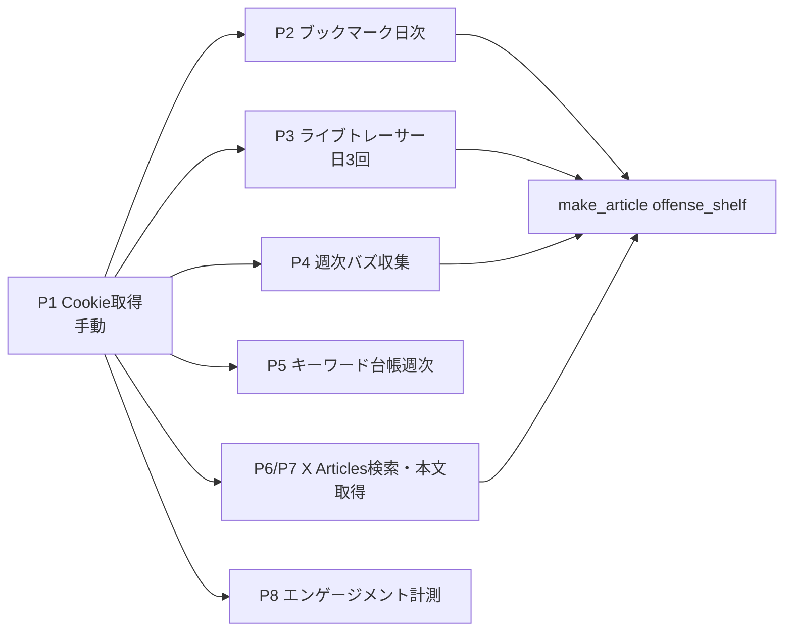

# influx architecture（機能マップ）

> influx が「いま実在する機能・道具・データの流れ」を1枚で説明する repo 正本。
> ⚠️ **influx は2系統が同居**する: **①株アルゴ研究（repo の約8割・別事業）** と **②X収集基盤（本書の対象）**。
> 本書は **②X収集基盤**の機能マップ。株アルゴ側は別途 `influx-stock-algo` として扱う（2026-08-08 オーナー裁定で2系統分割）。
> 目的/成功基準→ plan.md／現在地→ tasks/・司令塔／詳細は各スクリプト。ここは境界・I/O・道具・索引のみ。
> **2026-08-14 の確認範囲**: §4 の9工程が指すスクリプト9本の実在・launchd 4本の定義・自前スキル2本の置き場・P9 の配線を実測（機能の中身の正しさは未検証＝§8）。
> 初版の出自: make_article の理解ドキュメント `output/x-collection/understanding/influx-x-infra.md`（2026-08-08・調査報告）を、現行 repo で再確認して再構成（移送でない）。

## 1. 責務と非責務（最初に固定）

- **持つ**: X収集基盤の機能境界・repo をまたぐ I/O・使っている道具の一覧・既存正本への索引
- **持たない**（リンクで指す）: 株アルゴ研究の一切（別系統）／目的・成功基準（→ plan.md）／収集クエリの中身（→ `scripts/grok_collect_twittora.py` DEFAULT_QUERIES が正本）／群をまたぐ配線の詳細（→ vault `02_Ai/x-buzz/notes/x-buzz-architecture.md`）

### AI の Read / Write / Skip（vault-map）

| 区分 | 対象（パス・パターン） | 備考（なぜ） |
|---|---|---|
| **Read** | `plan.md` / 本ファイル / `scripts/` の X収集系（下表§4） / `configs/x_watchlist.json` | 作業開始時にまず読む |
| **Write** | `scripts/`（X収集系の改修）/ 本ファイル§7 未反映キュー / `configs/x_watchlist.json` | 収集ロジックと設定 |
| **Skip** | `x_profiles/`（Cookie=秘密・値を読まない）/ `output/`（巨大な生成物）/ 株アルゴ系 tasks・scripts（別系統）/ `_tmp_*.py`（使い捨て） | 秘密・巨大・別事業・一時物 |
| **Rules** | Cookie 値は絶対に転記しない ／ 収集クエリの正本は DEFAULT_QUERIES（本書は索引）／ 他プロジェクト（make_article）は本基盤を**読むだけ** | — |

## 2. システム全体像（X収集基盤）

## 3. データの入出力（I/O・repo をまたぐ線を重点）

| 機能 | input | output | 出所（ファイル:更新日） | source_env |
|---|---|---|---|---|
| P2 ブックマーク→make_article | X ブックマーク画面 | `output/bookmarks.jsonl` → make_article `offense_shelf.py` が読む | `understanding/influx-x-infra.md:2026-08-08`（現行 scripts で照合） | personal |
| P3 トレーサー→vault | `configs/x_watchlist.json` | `output/x_tracer/` + vault `.raw/x-tracer-*.jsonl` | 同上 | personal |
| P8 計測（make_article 起動） | 投稿 URL 群 | likes/views/RT/reply/bookmark の JSONL | 同上 | personal |
| Cookie→autopost | ホスト Chrome | `x_profiles/`（autopost が symlink 参照） | `influx/CLAUDE.md:2026-08-02` | personal |

## 4. 各機能の役割（9工程）

| 機能 | 役割（1行） | 実装 | 頻度 | 自動/人手 |
|---|---|---|---|---|
| P1 Cookie取得 | ホスト Chrome から X の Cookie を抜く | `scripts/import_chrome_cookies.py` | 不定（期限14日推奨） | 🖐手動 |
| P2 ブックマーク日次 | 本人ブックマークを取得し make_article へ渡す | `com.masa.bookmarks-daily`→`fetch_bookmarks.py` | 毎日07:25 | ⏰🐳 |
| P3 ライブトレーサー | watchlist の投稿を監視・急上昇を通知 | `com.masa.xbuzz-tracer`→`x_watchlist_tracer.py` | 日3回 | ⏰🐳 |
| P4 週次バズ収集 | 検索スクレイプでバズcoーパスを作る | `com.masa.xbuzz-buzz-collect`→`x_search_collect_twittora.py` | 月曜20:30 | ⏰🐳 |
| P4' 旧Grok経路 | クエリ定義の置き場（実行は停止・7/1切替） | `scripts/grok_collect_twittora.py`（DEFAULT_QUERIES 正本） | 停止 | 🖐 |
| P5 キーワード台帳 | ブックマーク差分から検索語台帳を更新 | `com.masa.x-keywords-weekly`→`obs-x-keywords` | 土曜10:00 | ⏰🐳 |
| P6 X Articles形式検索 | 長文記事を `url:x.com/i/article` で拾う | `scripts/search_x_articles.py` | 手動（launchd未配線） | 🖐🐳 |
| P7 X Articles本文取得 | 記事 URL から本文を全文取得（fail-closed） | `scripts/fetch_x_article.py` | 手動 | 🖐🐳 |
| P8 エンゲージメント計測 | 自投稿の実数を取る | `scripts/fetch_engagement.py`（make_article ラッパー起動） | 投稿後24h/72h | 🐳 |

> ⚠️ P9 フォロワー計測（`fetch_followers.py`）は**定期実行に配線されていない**。呼び出しは `x_watchlist_tracer.py` の中だけ（2026-08-14 実測 grep）。

## 5. 道具の一覧（何を・どう使っているか）

| 道具（一般名） | うちでの使い方 | 使い方の癖・なぜ | 置き換えが起きうる部分 | source_env |
|---|---|---|---|---|
| X の Cookie セッション | 公式API不使用・全部 Cookie+スクレイプ。Cookie正本は influx 1箇所、autopost は symlink | 複製しない（正本一元化） | X API v2（有料）／拡張経由 | personal |
| X の検索演算子 | `min_faves:` `since:` `until:` `f=top` を組む | **3〜4語まで**（6語ANDは全滅→0件を「市場が空」と誤裁定した実害） | 公式API検索 | personal |
| Playwright（Python同期API） | headless Chromium で DOM からカード抽出 | 部品をスクリプト間で相互 import して再利用 | Playwright MCP／claude-in-chrome／Selenium | personal |
| ヘッドレス+Xvfb/noVNC | headless なのに `DISPLAY=:99` 必須・6080でVNC覗ける | 「headless なのに DISPLAY 必須」が定型（教訓L001） | 完全ヘッドレス化 | personal |
| Docker（xstock-vnc 1コンテナ集約） | `docker exec -e DISPLAY=:99 xstock-vnc python3 …` の1行で叩く | Docker Desktop 自動起動+5分待ち／起動直後20秒スリープ | 収集単位でコンテナ分割 | personal |
| launchd | X収集の定時**4本**（ブックマーク日次・トレーサー日3回・週次バズ・キーワード週次。定義は `~/.claude/launchd/`）＋語収集 `com.influx.sedori-trend` 1本。**2026-08-13 に3本停止**（`x-update-proposals` / `xbuzz-weekly-pick` / `xbuzz-weekly-review` → `~/.claude/launchd/_disabled/`）。plist は薄く、リトライ・通知は runner 側 | ログは `~/.claude/state/<job>.{out,err}.log` に集約 | cron／GitHub Actions | personal |
| macOS 通知（osascript） | 収集失敗・急上昇を通知 | **成功でなく失敗を通知**（8日間気づかれなかった実害から） | Slack/Discord webhook | personal |
| JSONL 台帳 | append-only・URL重複スキップ | 過去行を書き換えず取り消しも新行 | DB化（不変性保証が条件） | personal |

### 5.1 AI 資産（スキル・コマンド・hook）

> 本節は全行 `source_env: personal`（環境側の持ち物・会社データを含まない）。

> 用途は §5 と同じ**突合表**（外部の活用術を自分の運用に当てる）。X で流れる「Claude Code 活用術」はこの層に当たるため、
> ここが空白だと投稿を「うちの何が良くなるか」に翻訳できない。
> **載せるのはこのプロジェクト固有のものだけ**。全プロジェクト共通のグローバル資産（skill 83本・コマンド 26本・hook 74本・2026-08-14 実測）は環境側の持ち物なので数だけ書き、個別列挙はしない。

| 資産 | 種別 | うちでの使い方（1行） | 使い方の癖・なぜそうしているか | 置き換えが起きうる部分 |
|---|---|---|---|---|
| `refresh-x-cookies`（`.claude/skills/`） | skill(自前・repo 内) | macOS Chrome のプロファイルから X の Cookie を抜いて暗号化保存 | **VNC Playwright 経路は bot 検知強化で廃止（2026-04-21）**。Chrome に X ログイン済みなら1コマンド | 公式 API（費用の裁定で不採用） |
| `x-post-to-kpi`（`.claude/skills/`） | skill(自前・repo 内) | X の投稿URLを KPI 仮説として取り込むかを判定する手順 | **投稿を読み切ってから判定**（本文・長文フィールド・添付図・スレッド続き）。既存カタログと重複照合し、実装可否まで見てから事前登録へ | — |
| `stop-influx-loop-closing.sh` | hook(global・**influx 専用**) | セッション終了時に周回の締めを機械催促する | プロジェクト名が焼き込まれた唯一の hook＝他プロジェクトには効かない | 各プロジェクト版の横展開 |
| `research-isolation` / `git-safety-reference` | skill(global) | 探索を main から隔離する型／git 事故の防止 | 思想は global・influx 固有の要点は repo CLAUDE.md 側 | — |

**この表の読み方**: X 収集側の固有資産は **2 本＋専用 hook 1 本**。収集の入口（Cookie）と出口（KPI 化）は固めたが、**間の「集めたものを判定する」層に固有資産が無い**。

## 6. 既存正本へのリンク（吸収しない）

| 情報 | 正本（ファイル） | 所有 |
|---|---|---|
| 目的・成功基準 | `plan.md`（⚠️ 4-5月停止・株アルゴ寄り＝§8参照） | リンク先 |
| 収集クエリの中身 | `scripts/grok_collect_twittora.py` DEFAULT_QUERIES | リンク先 |
| 群をまたぐ配線・障害史 | vault `02_Ai/x-buzz/notes/x-buzz-architecture.md` | リンク先 |
| **株アルゴ系統（同 repo のもう1系統）** | `influx-stock-algo-architecture.md`（repo 直下・2026-08-09 新設） | リンク先 |
| **詳細リファレンス**（環境変数一覧・collect_tweets オプション・インフルエンサーグループ定義・分類カテゴリ・テンプレ対応表） | `.claude/docs/architecture.md`（⚠️ 冒頭のモジュール構成・データフロー節は 5/2 停止＝現況は本書。信頼できるのは §環境変数 以降） | リンク先 |

## 7. 未反映キュー（機械が積む・人が消す）

<!-- stop-paired-docs-guard が scripts/configs/docker を触ったのに本書未更新の時に1行積む。人が更新したら消す。 -->

## 8. 矛盾・未確定（結論は書かない・移送先だけ）

- **未確定**: 旧 `plan.md`（4/24）・`.claude/docs/architecture.md`（5/2）は X収集の現行主力スクリプト（7-8月新設）を1本も載せていない＝**現状と食い違う**。→ どちらを正本にするかは influx セッションで裁定（本書は X収集の現行像を repo 正本として提示）。旧 `.claude/docs/architecture.md` は本書へ統合し退役予定（inbound 張替え後）
- **未確定**: 「X収集基盤14本」の件数（vault 記述）とスクリプト実体の1対1照合は未実施
- **未確認**: 週次ピック runner は 7/26 以降不発 →2026-08-08 にループ型で復旧（別途）。※ P9 の配線は 2026-08-14 に実測して §4 に反映済み
