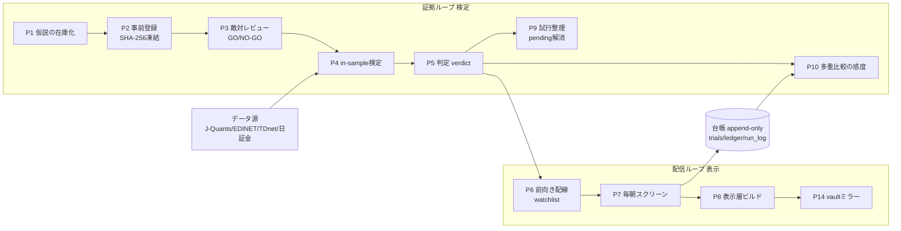

# influx / 株アルゴ研究 architecture（機能マップ）

> 株アルゴ研究系統が「いま実在する機能・道具・データの流れ」を1枚で説明する repo 正本。
> ⚠️ **influx は2系統が同居**する: **①株アルゴ研究（本書の対象）** と **②X収集基盤**。
> ②は兄弟ファイル [`influx-architecture.md`](./influx-architecture.md) が持つ（2026-08-08 オーナー裁定で2系統分割）。
> 数値定義・閾値・合格基準→ `docs/stock-algo-kpi-catalog.md`／事前登録と試行の記録→ `docs/` `data/kpi_trials/`／現在地→ `tasks/`。
> ここは**境界・I/O・道具・索引のみ**。個別銘柄・保有・損益は一切書かない（工程と道具だけ）。

## 1. 責務と非責務（最初に固定）

- **持つ**: 株アルゴ研究の機能境界・工程間の I/O・使っている道具の一覧・既存正本への索引
- **持たない**（リンクで指す）: X収集基盤の一切（→ 兄弟ファイル）／目的・成功基準（→ `tasks/stock_algo_kpi_loop.md`）／合格基準・α体系・ベースレート・pending 規約（→ `docs/stock-algo-kpi-catalog.md`）／個別仮説の事前登録本文（→ `tasks/*_preregister.md`）／試行の実データ（→ `data/kpi_trials/trials.jsonl`）／現在の裁定待ち（→ `tasks/segment_expansion_review.md`）

### AI の Read / Write / Skip（vault-map）

| 区分 | 対象（パス・パターン） | 備考（なぜ） |
|---|---|---|
| **Read** | 本ファイル / `docs/stock-algo-kpi-catalog.md` / `tasks/*.md` / `config/paper_watchlist.json` / `config/launchd/` | 株アルゴの実態の正本はここ（CLAUDE.md・plan.md ではない・§8） |
| **Write** | `scripts/`（検定・スクリーンの改修）/ `tasks/*.md` / 本ファイル§7 未反映キュー / `config/` | 実装と追跡 |
| **Skip** | X収集系の scripts・tasks（別系統→兄弟ファイル）/ `scripts/_tmp_*.py`（使い捨て・27本）/ `output/_tmp_*` `output/_scratch_*` `output/_probe*`（探索の残骸）/ `data/jquants/` `data/edinet/` `data/tdnet/`（巨大な生データ）/ `tasks/lessons.md`（パーミッション600） | 別事業・一時物・巨大・保護 |
| **Rules** | ① `data/kpi_trials/*.jsonl` は **append-only**（過去行を書き換えない・取り消しも新行）② 事前登録は SHA-256 凍結後**変更＝仮説の放棄**（AIが勝手に条件を直さない）③ Bonferroni 分母＝ trials.jsonl 行数、**分母の圧縮は恒久禁止** ④ 新規仮説の凍結前に必ず Codex 敵対レビューの GO を取る ⑤ ホスト上 `pip install` 禁止（Docker `xstock` 経由） | — |

## 2. システム全体像（二層構造）

## 3. データの入出力（I/O・系統をまたぐ線を重点）

| 機能 | input | output | 出所（ファイル:確認日） | source_env |
|---|---|---|---|---|
| データ取得 | J-Quants / EDINET / TDnet / 日証金 / e-Stat / 商品価格 | `data/jquants/` `data/edinet/` `data/tdnet/` `data/jsf/` ほか | `scripts/jq_fetch.py` ほか実在確認:2026-08-09 | personal |
| P4/P5 検定→台帳 | 上記 bars・fins | `data/kpi_trials/trials.jsonl`（114行） | 実測 `wc -l`:2026-08-09 | personal |
| P7 毎朝スクリーン | `config/paper_watchlist.json`（19件）・当日 bars | `output/paper_today.md` / `data/paper_trades/ledger.jsonl`（576行） | 実測:2026-08-09 | personal |
| P8 表示層 | ledger・meta・watchlist の凍結値 | `output/recipe_shelf.md` / `output/daily_reco.md` | 実測（mtime 2026-08-07）:2026-08-09 | personal |
| P9 pending 解消 | trials の pending 行 | `data/kpi_trials/resolutions.jsonl`（82行・**trials には書かない**） | `tasks/pending_verdict_flow.md`:2026-08-08 | personal |
| 実行証跡→vault | 日次実行 | `data/monitoring/run_log.jsonl` + `run_log_hashchain.txt` → vault へ別媒体ミラー | 実在確認:2026-08-09 | personal |
| **X収集基盤から借りるもの** | 兄弟系統の Cookie セッション・Playwright 部品 | `price_watch` / 銘柄言及抽出 / インフルエンサー capture が利用 | [`influx-architecture.md`](./influx-architecture.md) | personal |

## 4. 各機能の役割（14工程）

| # | 工程 | 役割（1行） | 実装（実在確認済み） | 頻度 | 自動/人手 |
|---|---|---|---|---|---|
| P1 | 仮説の在庫化 | 外部リサーチ・X採掘・棚卸しでバックログを作る | catalog §8 | 不定期（**現在停止**） | 🖐＋AI |
| P2 | 事前登録 | 1本を §7-X 節に書き SHA-256 で凍結してから測る | catalog §7 / `tasks/*_preregister.md` | 1周ごと | 🖐 |
| P3 | 敵対レビュー | 凍結前に GO/NO-GO を取る（NO-GO は素直に受ける） | `/adversarial-review` + Codex MCP | P2 直後・必須 | 🖐 |
| P4 | in-sample 検定 | 統計量を計算し台帳に1行 append | `scripts/kpi_event_study.py` | GO後1回 | 🐳 |
| P5 | 判定 (verdict) | 5基準で pass候補 / fail / pending を出す | 同 `judge()` | P4 と同時 | 🐳 |
| P6 | 前向き配線 | 運用開始ライン充足の系統を watchlist へ | `config/paper_watchlist.json`（19件） | 裁定後 | 🖐＋自動 |
| P7 | 毎朝スクリーン | 当日シグナルを出し台帳へ記録 | `scripts/daily_screen.py` | 平日07:30 | ⏰ |
| P8 | 表示層ビルド | 棚と当日推奨を md に組む | `scripts/build_recipe_shelf.py` / `build_daily_reco.py` | 平日07:30 | ⏰ |
| P9 | 試行整理 | pending を5値の語彙で終端へ（判決ではない） | `scripts/kpi_pending_resolutions.py` | 日次audit／裁定は四半期 | ⏰＋🖐 |
| P10 | 多重比較の感度確認 | 分母＝台帳行数で調整後CIを見る | `scripts/kpi_bonferroni_check.py` | 周次 | 🐳 |
| P11 | 一括スクリーニング | 宣言グリッドを FDR で流す | `scripts/kpi_screen_batch.py` | **現在禁止**（catalog §6拡張5項） | 🐳 |
| P12 | EV estimand v2 | 月等ウェイト two-stage で EV を出す | `scripts/ev_estimand_v2.py` / `kpi_event_study.ev_v2_summary` | 改定時 | 🐳 |
| P13 | 商品価格レーン | 外部価格の発火→受益カード→前向き記録（発火・通知・evaluation 行に受益タイプを付与 2026-08-15）。**仕込み型の閲覧面は `output/daily_reco.md` の「🌱 仕込み型」節に一本化**（2026-08-16・毎朝 daily_screen 経由で対TOPIX超過を再計算。`build_shikomi_list.build_rows()` が計算の Canonical・同モジュールは永続ファイルを書かない＝第二の閲覧面を作らない。週次ジョブは forward_log の更新のみ担当） | `scripts/price_universe_check.py` / `build_shikomi_list.py` / `xprice_watch_run.sh` | 月曜08:30＋毎日22:10 | ⏰ |
| P13a | 海外上場の受益カード（§16w・2026-08-17 P-08c裁定） | 商品の供給ショックは受益者が海外に偏るため、受益カードに海外銘柄を認める。`market`/`ticker`/`benchmark` 必須・**対TOPIX前向き台帳には入れない**（`skipped_foreign` に理由を残す）・通知は `[IE]Glanbia plc` 形式。初カード= Glanbia plc（dry-whey 系列） | `price_universe_check.beneficiaries_display` / `price_watch_forward.record_firings` | 本線と同じ（月曜08:30） | ⏰ |
| P13b | 監視カバレッジの物差し | 「独立ドライバー×稼働取得経路×関門通過カード」の重複除外集合を数える（P-08a 裁定 2026-08-17・入力件数では面積を測らない）。§16v の浸透カード有無で食品ミュートの部分解除も反映。出力= `output/coverage_census.md` | `scripts/coverage_census.py`（判定の正本は `price_universe_check.pass_through_cards`） | 手動（拡張の前後で実行） | 🖐 |
| P13' | 受益タイプ一覧 | center_pin 977社を型別一覧 md に組む（ラベル正本= `x_mention_dict.PIN_TYPE_LABELS` を共有） | `scripts/gen_center_pin_types.py` → `output/center_pin_types.md` | 手動 | 🖐 |
| P15 | ニュース供給ショック | 商品名つき供給ショック（禁輸・スト・攻撃）を Google News RSS から検知→受益カード銘柄を型付き通知＋前向き記録（入場条件=§16u・プレレジ凍結 2026-08-16） | `scripts/news_shock_collect.py` / `news_shock_eval.py` / `news_shock_run.sh` → `data/news_shock/news_log.jsonl` | 毎日07:20+19:00（launchd 登録待ち） | ⏰（Docker不要） |
| P14 | vault ミラー | 当日シグナル・台帳・hash chain を vault へ写す | 上記ジョブに同乗 | 毎朝 | ⏰ |

### 4-1. 定期実行（配管図が正本）

本数・時刻・入口の表と稼働の注意書きは **`docs/pipeline-map.md`（機械生成）** が持つ（2026-08-14 移設・手書き表は腐っていた）。

### 4-2. 走行中の前向きレーン（4本・お金は張っていない）

| レーン | 台帳 | 執行の正本（事前登録） |
|---|---|---|
| S1 TOB収斂 | `data/paper_trades/tob_ledger.jsonl` | `tasks/tob_deal_policy_preregister.md` |
| S2 ペーパー（枠S/F） | `data/paper_trades/ledger.jsonl` | `config/paper_watchlist.json` |
| S3 KPI×KPI ペア | `data/paper_trades/pair_forward_ledger.jsonl` | `tasks/pair_forward_preregister.md` |
| S4 インフルエンサー前向き | `output/influencer_candidates/` 配下 | `tasks/influencer_discovery_preregister.md` |

## 5. 道具の一覧（何を・どう使っているか）

### A. データ源

| 道具（一般名） | うちでの使い方 | 使い方の癖・なぜ | 置き換えが起きうる部分 |
|---|---|---|---|
| J-Quants API（JPX公式・有料） | 日本株の価格・財務・上場銘柄・カレンダーを `scripts/jq_fetch.py` で取得（**一次データ源**） | 現在の銘柄リストから出発せず**各月末時点でユニバースを組み直す**（サバイバーシップバイアス防止） | 上位プラン昇格（配当補正）／TDnet アドオン（未購入） |
| EDINET API（金融庁・無料） | `scripts/edinet_fetch.py --dataset documents_all` で全件収集・5年バックフィル済み | TDnet スクレイプは**規約実査で不採用**（自動取得を明文で禁じている）→ 無料公式APIへ全面移行 | 有償アドオンでしか取れない開示領域 |
| TDnet インデックス（適時開示） | `scripts/tdnet_index_fetch.py` で寄付前に当日シグナルを判定 | 表題を NFKC正規化→空白除去→**評価順を固定した regex 5段**で凍結。境界ケースの golden test を同梱し sha256 で固定 | 第三者API単一依存を EDINET 副系統で緩和中 |
| 日証金（貸借・逆日歩） | `scripts/jsf_daily_archive.py` で日次アーカイブ | **「取れる時に貯めておく」型**（過去に遡れないので使う予定が立つ前から貯める） | — |
| e-Stat（生産動態統計・無料） | 無認証DLで「金額÷数量＝実効単価」を機械算出 | 古い .xls を**自作 BIFF8 パーサ**で読む（既存月の突合で検証PASS） | 現在は1系列のみに縮小（受益マッピング不成立） |
| DRAMeXchange / TrendForce | メモリのスポット価格を週次取得し受益カードに結線 | パーサが**4重 fail-closed**（ヘッダ順一致・有効行一意・符号排他・日付近傍窓）。壊れたら黙って通さず止める | 会社側の開示縮小で契約価格が唯一の代理窓という制約 |
| Alpha Vantage（無料枠） | 米国株ウォッチリストの価格取得に採用予定（**APIキー取得待ち**） | キー取得後の最初の作業を「無料枠で本当に取れるか **1リクエストで実測**」と決めてある（推測で設計しない） | Yahoo自動取得・Stooq 迂回は**規約上NGで確定**（迂回策を封じてある） |
| yfinance | 勝率採点・周辺分析でのみ使用 | 本体の検定は J-Quants 側で完結・yfinance は周辺限定 | 米国レーンで Alpha Vantage と役割が重なる |
| X（Twitter）本文の自前収集 | ①価格上昇の兆し `price_watch` ②銘柄言及の抽出 ③インフルエンサーの前向き capture | **クエリを凍結して sha で実効化**（検索語を後から足すと時系列が壊れる）。上限つき・追加は死に筆との入替のみ | 「件数を数える」→「本文を読む」への転換は済 |
| Grok API（xai-sdk） | インフルエンサー候補の発見・シグナル抽出 | `web_fetch` は X.com にハルシネーションを返すため**認証ブラウザ必須**（教訓 L002） | 発掘レーン自体が打ち止め＝新規工数ゼロ |

### B. 実行・運用

| 道具 | うちでの使い方 | 使い方の癖・なぜ | 置き換えが起きうる部分 |
|---|---|---|---|
| launchd | 株アルゴ系で8ジョブ（§4-1） | ①**登録はユーザーが `!` で手打ち**（セッションUI経由は過去2回とも実行されなかった）②**fail-closed**＝失敗を沈黙させず通知③朝ジョブに `--audit` を相乗りさせ SLA超過で exit 1 | cron / GitHub Actions。※ TCC（フルディスクアクセス）が移行時の論点 |
| Docker / compose（`xstock` イメージ） | 依存管理と検定バッチの実行環境 | ホスト `pip install` を禁止し、**依存を足したら requirements.txt →イメージ再ビルド**の順で通す | — |
| Python（pandas / numpy のみ） | 検定・集計の主力 | **ML を意図的に使わない**（重み推定は死んだ型として明示的な禁止事項） | 分類器の導入（現状は禁止側） |
| openpyxl / pypdf / 自作BIFF8 | 月次PDF・xlsx・古い xls の読み取り | **parse_fail を無音にせず要確認リストに出す** | — |
| JSONL の append-only 台帳 | 試行・整理・FDRセル・ペーパー約定・実行証跡 | ①過去行を書き換えない（取り消しも新行・同一キーの最終行が現在状態）②書込み前後で**行数+sha256 を機械照合**し不一致は FATAL ③`fcntl` ロック＋3点照合 | DB化。ただし append-only が統計規律の担保なので同等の不変性保証が要る |
| hash chain | run_log の末尾hashを日次連鎖させ vault へ**別媒体ミラー** | 「自分の成績を後から書き換えられない」ことを自分に証明する仕組み。別媒体に置くのが要点 | — |
| git | 台帳・設定・スクリプトを追跡（生データは untracked） | 意味単位でコミット・`git add -A` 禁止。誤発火の記録を除いた時も「git履歴に原本保全」と明記して消さない | — |
| macOS 通知（osascript） | 朝ジョブ完了・SLA超過・発火を通知 | 「沈黙＝順調」に見えないよう**成功語だけを watch せず全終端を拾う** | Slack / LINE |

### C. 判断・レビュー

| 道具 | うちでの使い方 | 使い方の癖・なぜ | 置き換えが起きうる部分 |
|---|---|---|---|
| Claude Code（SubAgent 並列） | 検定の実装・事前登録の起草・使い捨て調査役 | **1 SubAgent 1タスク**。調査系の成果物は `output/research/` に隔離して本線に混ぜない | — |
| Codex MCP（異モデル） | **全ての事前登録に対する敵対レビューの実行役**（GO が出るまで凍結しない） | ①NO-GO を素直に受ける（NO-GO 複数回→GO が常態）②**実装後にもう一度レビュー**（設計GO≠実装GO）③threadId を記録して追跡可能に | 同モデル別文脈のレビュアーAと2体制（片方だけにはしない） |
| 敵対的クロスレビュー（同モデル別文脈 × 異モデル） | 議題を2体に**独立に**解かせ「一致／割れ」に分けて裁定へ上げる | ①相互出力を**共有しない**②統括が片方と同モデルなら「構造的に寄り得る」と自己申告③割れた点だけ1問ずつ出す | — |
| Obsidian（vault） | 司令塔・当日シグナル/台帳のミラー・hash chain の別媒体保存 | **vault は「窓」で正本ではない**（実体SSoTは repo）。hash chain だけは「別媒体」目的で例外的に意味を持つ | Notion / スプレッドシート |
| 事前登録（プレレジ）という作法 | 仮説ごとに節を書き **SHA-256 で凍結してから測る** | 学術のプレレジを個人投資検証に持ち込んでいる。凍結後の変更＝**仮説の放棄**（α消費済みで閉じ、新規登録し直し） | — |

### D. 統計・方法論（偽発見統制）

| 道具 | うちでの使い方 | 使い方の癖・なぜ | 置き換えが起きうる部分 |
|---|---|---|---|
| ホールドアウト法 | 期間を前半 in-sample / 後半ロックに分割 | 開封を**1回で使い切る**運用（実際に1回使い、効果の消滅を確認して棄却）。以後の再開封は禁止 | — |
| 月次ブロック・ブートストラップ | リフト/EV の信頼区間の算出 | **独立試行を仮定した二項CIを使わない**（月次コホートの横断相関・窓の系列相関で実際より狭くなる）。既定の反復数は歴史的比較可能性のため変更しない | — |
| Bonferroni 補正 | 分母＝ `trials.jsonl` の行数 | **分母の後付け圧縮を恒久禁止**（失敗した試行を無かったことにしない）。表示は常に「消費N / 整理済みN」と分母ごと出す | online-FDR への移行は起案されたが**現行FWER維持で決着** |
| BH-FDR / BY 補正 | 一括スクリーニングで発見半期→検証半期 | BH通過・BY非通過のセルは**「統計的発見」と呼ばない**と明文化。FDR の目的を「量産」でなく前向き検証への優先順位付けに限定 | — |
| two-stage estimand（月等ウェイト） | EV を月内平均→グランド平均の2段で出し**片側95%下限**で判定 | 素のプール平均は発火が集中した月に引っ張られるため移行。**過去 verdict へは遡及適用しない** | — |
| イベントスタディ | 全履歴一括で実行 | 「1ヶ月前→2ヶ月前→…」と遡る **walk-back 方式を明示的に不採用**（初期結論が直近地合いの極少サンプルに支配される） | — |
| PIT（point-in-time）実装ルール | 財務は開示日基準・週次信用残は公表日以降・辞書は年次バージョン | 「暗黙の実装判断は再現性と後知恵混入の温床」として、シグナル確定時点・エントリー日・括弧付き論理式を**各KPI仕様書の必須欄**にしている | — |
| 効果量 / 順位相関 / モンテカルロ | 弁別力・勝率とEVの関係・目標到達確率の把握 | いずれも**記述・意思決定用で台帳不算入**（これで合否は決めない）と明記して混入を防ぐ | — |

### 5.1 AI 資産（スキル・コマンド・hook）

> §5 と同じ突合表。**載せるのはこのプロジェクト固有のものだけ**（全プロジェクト共通の資産は環境側の持ち物＝数だけ書き個別列挙しない）。

| 資産 | 種別 | うちでの使い方（1行） | 使い方の癖・なぜそうしているか | 置き換えが起きうる部分 |
|---|---|---|---|---|
| `beneficiary-attribution` | skill(自前) | 「この商品の値上がりで得をするのはどの会社か」を帰属プロトコル v2 の5関門で判定 | **業種名からの推定と後付けの大手挙げを禁止**。判定ルールの正本は `docs/price-watch-universe.md` §0b | — |
| `daily-reco-answer` | skill(自前) | 「今日の推奨銘柄は？」への答え方を固定（社名＋コード併記・正式合格とペーパーを必ず区別） | 回答のブレ（コードだけ返す・所在を書かない）を止めるための型 | — |
| `loop-diagnosis-ledger` | skill(自前) | 「なぜ勝てる株が出てこないのか」の構造診断で、過去に確定した論点を先に出し差分だけ議論する | **毎回ゼロから2モデル議論を始めない**（同じ結論への反復を止める） | — |
| `price-source-onboarding` | skill(自前) | 値上がり検出網に新しい価格系列を1本足す手順 | パーサの落とし穴（列ズレ・0件時の誤採用・存在しないURLが200を返す）を潰すまでが1周 | — |
| `stop-influx-loop-closing.sh` | hook(global・**influx 専用**) | セッション終了時に周回の締めを機械催促する | プロジェクト名が焼き込まれた唯一の hook | 各プロジェクト版の横展開 |
| `research-isolation` / `git-safety-reference` | skill(global) | 探索を main から隔離する型／git 事故の防止 | — | — |

**この表の読み方**: 自前スキル4本はすべて**「AI の答え方・判定の仕方」を固定する型**で、データ処理そのものの自動化ではない。X の活用術で当たるのは「判断の型を機械に守らせる」系。

## 6. 既存正本へのリンク（吸収しない・二重に書かない）

| 情報 | 正本（ファイル） | 所有 |
|---|---|---|
| 目的・成功基準・周回履歴 | `tasks/stock_algo_kpi_loop.md` | リンク先 |
| 合格基準・α体系・ベースレート・pending 規約・入場ゲート・探索prior | `docs/stock-algo-kpi-catalog.md` | リンク先 |
| 事前登録（§7-X 節・SHA-256 凍結本文） | 同 catalog §7 ＋ `tasks/*_preregister.md` | リンク先 |
| 試行台帳（Bonferroni 分母の実体） | `data/kpi_trials/trials.jsonl` | リンク先 |
| pending 解消の設計と実行結果 | `tasks/pending_verdict_flow.md` | リンク先 |
| EV estimand v2 の実測 | `tasks/ev_estimand_v2_results.md` | リンク先 |
| レーン別の歩留まり・打切り基準 | `docs/recipe-lanes-portfolio.md` | リンク先 |
| 現在の裁定待ち議題 | `tasks/segment_expansion_review.md` | リンク先 |
| 毎日見る司令塔・進捗ダッシュボード | vault `02_Ai/influx/influx-kpi-cockpit.md` / `influx_ope.md`（⚠️鮮度は §8） | リンク先 |
| **もう1系統（X収集基盤）** | [`influx-architecture.md`](./influx-architecture.md) | リンク先 |
| 検証の回し方の一般則 | グローバル skill `prereg-freeze-cycle` | リンク先 |
| **詳細リファレンス**（環境変数一覧・分類カテゴリ等） | `.claude/docs/architecture.md`（⚠️ モジュール構成・データフロー節は 5/2 停止・X収集寄り） | リンク先 |

## 7. 未反映キュー（機械が積む・人が消す）
- [ ] 2026-08-16 `build_trial_fingerprints.py`、`tdnet_event_profile.py` を更新（この文書への反映を確認）

## 8. 矛盾・未確定（結論は書かない・移送先だけ）

- **未確定**: `plan.md`（2026-04-24）・`.claude/docs/architecture.md`（2026-05-02）・`CLAUDE.md`（2026-08-02）は**株アルゴ研究に実質的に触れていない**（株アルゴは 2026-07 開始）。実害として `tasks/*_preregister.md` の複数が冒頭で `plan.md` を「上位」とリンクしているが参照が空振りしている。→ どちらを正本にするかは influx セッションで裁定（**兄弟ファイル §8 と同一の矛盾**・本書は株アルゴの現行像を repo 正本として提示）
- **未確定**: repo の定義本数と `launchctl` 登録本数の食い違い（未ロード4本・うち `edinet-tob` は道具表Aで「稼働中」と書かれている）→ 実態と注意書きは `docs/pipeline-map.md` §4 が持つ。棚卸しは influx セッションで
- **未確定**: 「18系統」が指す集合が文書ごとに違う（vault ダッシュボード「毎朝18系統」／`config/paper_watchlist.json` は19件〈observation 17・reference 1・hoos_rejected 1〉／`tasks/segment_expansion_review.md`「前向き接続18本」／`tasks/pending_verdict_flow.md` の `awaiting_forward` 18）。→ どれが正しいかは決めない
- **未確定（vault 表示のずれ3件・いずれも vault 側で解消）**: ①試行数 109行（2026-07-15 断面）vs catalog/実測 114 ②目標本数「10本」の旧表記が cockpit・`docs/recipe-lanes-portfolio.md` に残存（読み替えの正本= catalog §6付記III）③`influx-kpi-cockpit.md` の frontmatter `last_updated: 2026-07-16` と本文が非同期
- **未確認（本書で裏取りできなかった）**: ① 各 launchd ジョブが**実際に成功しているか**（`launchctl list` の最終 exit code が 0 であることのみ確認・`run_log.jsonl` の中身は未読）② `scripts/` 実装コードの中身（`judge()` の5基準・Bonferroni 分母の実装箇所は catalog の記述の引用であり、コード実読による確認はしていない）
- **参考（矛盾ではない）**: `scripts/unified_shadow_eval.py` は未実装＝ `tasks/unified_shadow_portfolio_preregister.md` の「Codex GO 後に着手」通りの状態
