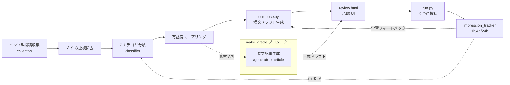
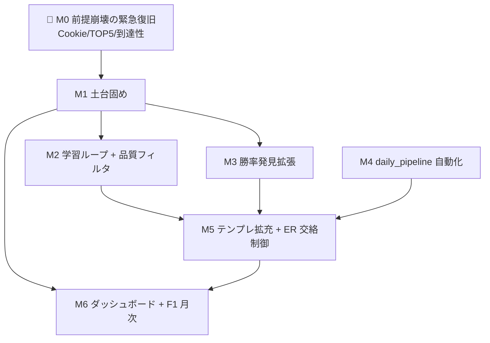

# influx プロジェクト半年計画 (2026-05 〜 2026-10)

**採用構成**: 株インフルエンサー投稿の**収集・分類・投稿インフラ**に責務集中
**策定日**: 2026-04-18（初版）/ 2026-04-22（責務分離リファクタ、記事生成系は `make_article` プロジェクトへ移管）
**対象期間**: **M0 (2026-04-20 開始、緊急対応)** → M1 (2026-05) 〜 M6 (2026-10)

---

> ## 🚨 現在地マーカー (2026-04-22)
>
> **最上位前提「勝率インフル投稿の到達性」の復旧中。** 現状:
> - ✅ T0.1 Cookie 更新完了（2026-04-21、両アカウント `import_chrome_cookies.py` 経由で認証成功）
> - ⏳ T0.2 非活動チェック再実行（`python scripts/check_inactive_accounts.py`）
> - ⏳ T0.3 Grok 20BD 再評価 + score 算出
>
> **次アクション**: `## M0` セクションの T0.2 から継続。

---

## 本プロジェクトの責務（プロジェクト間の分界）

| 責務 | 所管プロジェクト |
|---|---|
| **X インフル投稿の収集・ノイズ除去・7 カテゴリ分類・勝率評価** | **influx（本プロジェクト）** |
| **Cookie 運用・`daily_pipeline.py`・`check_inactive_accounts.py`** | **influx** |
| **投稿インフラ（`compose.py`・`review.html`・`run.py`・`account_routing`・`impression_tracker`）** | **influx** |
| **長文記事生成・教師データ蓄積（Material Bank / Pattern Library）・良記事テンプレ設計・10000 imp KPI** | **`make_article` プロジェクト**（`/Users/masaaki_nagasawa/Desktop/biz/make_article/`） |
| **Grok アーキテクトスタイル学習・3 テーマ戦略（investment / tech_tips / ceo_perspective）** | **`make_article`** |
| **連携①（make_article → influx）** | make_article `/post-article` → influx の `run.py`（予約投稿 API） |
| **連携②（influx → make_article）** | 分類済ツイート素材 API（M2 以降で実装予定・タスク未起票）＋ 読者反応 JSONL（T6.4 成果物 `output/reader_feedback.jsonl`、Pattern Library 還流用） |
| **運用アカウント戦略（`@twittora_` 主軸・`@kabuki666999` 準主軸、bio・投稿頻度・KPI）** | 横断 SSoT [`../account_strategy.md`](../account_strategy.md)（本 plan.md には数値を重複させない。M4 日次パイプラインは SSoT の頻度に従う） |

---

## プロジェクトの軸

### 目的
株インフルエンサーの X 投稿を**収集・分類**し、**投稿管理インフラ**を通じて自アカウントから株ニュース投稿を行う。

> 長文記事の生成・教師データ蓄積・10000 imp 追求は `make_article` プロジェクトの責務。influx は「情報源の質」と「投稿インフラの安定」に集中する。

### 投稿頻度
**1 日 1 投稿**（マルチアカウント運用時は各アカウント 1 投稿/日）

### 成功基準（最重要）
> **有益な情報を大量に仕分け、正確に記事テンプレートへ振り分ける**

| 要素 | 測定方法 | 測定者 | 閾値 |
|---|---|---|---|
| **仕分けの量** | `output/collection_metrics.jsonl` の日次合計 | T1.7 自動 | 日次 ≥ **100 ツイート/日**（M1 でベースライン確定） |
| **分類の精度** | `scripts/measure_f1.py` で 7 カテゴリ macro/micro F1 | T2.0 自動 + 月次 | macro F1 ≥ **0.80**（M2）→ **0.85**（M6） |
| **記事振り分けの正確性** | 月次サンプリング（30 件/月、compose 出力）を人手レビュー | ユーザー or 委託 | 誤振り分け率 < **5%**（M6 T6.5） |
| **収集→素材提供の時間** | `pipeline_log/{date}.jsonl` の `collect_start_at` → `classify_done_at` 差分 | T1.9 自動 | 通常時 ≤ 30 分（収集量に比例） |

### KPI

| 優先軸 | 内容 |
|---|---|
| KPI 1 | 1 日 1 投稿の `engagement_rate` の継続的向上（投稿インフラの質担保） |
| KPI 2 | 分類 F1（7 カテゴリ × Gold Set、月次計測） |
| KPI 3 | 手動運用時間の削減率 |
| KPI 4 | 勝率の高いインフルエンサー特定数（N 名以上、暫定 N=5） |
| 補助 | 日次収集量・ノイズ率・カテゴリ別ドラフト生成数・誤振り分け率 |

**M2 着手ゲート**: Gold Set F1 ≥ 0.80

---

## 7 カテゴリ（株テーマの投資判断シグナル、T1.0 完了）

1. オススメしている資産・セクター (`recommended_assets`)
2. 個人で購入・保有している資産 (`purchased_assets`)
3. 申し込んだ IPO (`ipo`)
4. 市況トレンドに関する見解 (`market_trend`)
5. 高騰している資産 (`bullish_assets`)
6. 下落している資産 (`bearish_assets`)
7. 警戒すべき動き・逆指標シグナル (`warning_signals`)

**カテゴリ → テンプレート対応表**（`collector/config.py` の `CATEGORY_TEMPLATE_MAP`、T1.0 完了）:

| カテゴリ | 主テンプレート | 備考 |
|---|---|---|
| `recommended_assets` | `hot_picks` | 銘柄名含有のみ採用 |
| `purchased_assets` | `trade_activity` | `hot_picks` との重複停止 |
| `ipo` | `hot_picks`（IPO サブ） | 「IPO」必須タグ |
| `market_trend` | `market_summary` | |
| `bullish_assets` | `hot_picks` | `is_contrarian=True` は `warning_signals` へ（逆神方針 2026-04-19） |
| `bearish_assets` | `market_summary` | |
| `warning_signals` | `contrarian_signal` | |
| カテゴリ外（決算） | `earnings_flash` | M5 で 7 カテゴリ統合 or 廃止判断 |

---

## パイプライン（収集 → 素材提供 → 投稿インフラ）

| ステップ | 実装 | 現状 |
|---|---|---|
| 記事生成（短文） | `extensions/tier3_posting/cli/compose.py` | 7 テンプレート実装済み・稼働中 |
| 記事生成（長文） | `make_article` の `/generate-x-article` | 別プロジェクト、influx は素材 API で連携 |
| 管理画面 | `extensions/tier3_posting/ui/review.html` + `server.py` | カレンダー UI 稼働 |
| 予約投稿 | `extensions/tier3_posting/cli/run.py` | 稼働中、マルチアカウント対応済 |

---

## 前提条件（クリティカル依存）

> **最上位前提**: 勝率が高いインフルエンサーの投稿が取得できないと、株ニュースとして成立しない。
> 低勝率/ノイジーなインフル投稿は下流の分類・compose・投稿がどれだけ高品質でも「参考に値するニュース」にならない。

| 前提 | 説明 | 成立条件 |
|---|---|---|
| **勝率インフル投稿の到達性**（最上位） | 高勝率（Grok `score ≥ 70`、現行 TOP5）が (a) アクティブ投稿、(b) 非公開/凍結/BAN/ブロックされず、(c) Cookie 経由で取得可能 | TOP5 のうち **4 名以上が週次投稿中 + 全員 Cookie 経由で取得可能** |
| **収集量** | 日次で 7 カテゴリに十分なシグナル | 日次 **100 ツイート/日以上** |
| **アクティブインフル** | 登録 30 アカウントの直近 7 日以内投稿 | **20 アカウント以上**アクティブ |
| **インフル鮮度** | 勝率の低いアカウントを除外 + 新規高勝率候補の発掘 | Grok 20BD 再評価を四半期ごと |
| **Cookie の有効性** | 収集 Cookie が失効していない | 期限切れ 7 日前に手動更新（`import_chrome_cookies.py`） |
| **Gold Set** | F1 計測の拠り所 | 35 件（M1）→ 100 件（M6） |

---

## 基本方針

「収集 → ノイズ除去 → 分類 → 有益度評価 → 記事作成 → 管理画面承認 → X 予約投稿 → 効果計測 → 学習」のゴールデンパスに工数の 80% を投下。

**現状の最大ボトルネック**:
1. 上流の収集量・リスト鮮度が計測されていない（T1.7 完了済）
2. 分類精度を測る Gold Set がない → 35 件生成済、人手ラベリング待ち
3. Grok 20BD 再評価が期限超過（M0 T0.3 で再実施）

M1 で土台（カテゴリ整理・Gold Set・収集量モニタリング・Grok 再評価）を一気に固め、M2 で学習ループとノイズ除去を稼働させる。

---

## 現状スナップショット (2026-04-24 更新)

> **アカウント運用状況**（詳細は [`../account_strategy.md`](../account_strategy.md)）:
> - `@twittora_` — 14年休眠中、復活予定（make_article 側 `tasks/account_strategy_kickoff.md` で下書き準備中）
> - `@kabuki666999` — 週2投稿目標（火木 20:00）。bio 改修案1 適用予定（`tasks/kabuki_strategy_sync.md`）

## 現状スナップショット (2026-04-22 更新)

> **⚠️ 最上位前提が崩壊中** — TOP5 特定不能 / Grok 20BD 期限超過 / 到達性未測定。§M0 参照。

### 資産（引き継ぎ可能）

| 領域 | 資産 |
|---|---|
| 分類 | 7 カテゴリ体系 + `CATEGORY_TEMPLATE_MAP`（T1.0 完了） |
| 収集 | `collector/x_collector.py` + 30 アカウント定義 + Cookie 運用 |
| 投稿 | `extensions/tier3_posting/` エクステンション化（compose/run/track/manage） |
| Cookie 運用 | `scripts/import_chrome_cookies.py`（macOS Chrome 抽出、唯一の確実経路） |
| マルチアカウント | `account_routing.py`（`CATEGORY_ACCOUNT_MAP` 自動導出、T5.3 完了） |
| スケジューラ | `scripts/scheduler/{plist, crontab.txt}` |

### パイプライン別

| ステップ | 稼働度 | 課題 |
|---|---|---|
| 収集 | ◯ | 収集量モニタリング稼働（T1.7 完了）、Cookie 期限切れ通知（T1.5 完了） |
| ノイズ除去 | ✗ | **未実装**。M2 T2.3 |
| 分類 | ◯ | 7 カテゴリ統一済（T1.0 完了）、Gold Set 35 件生成済（人手ラベリング待ち） |
| 有益度評価 | ✗ | **未実装**。M2 T2.4 |
| 記事作成 (`compose.py`) | △ | 7 テンプレ稼働、experiment_id 付与済 |
| 管理画面 (`review.html`) | ◯ | `engagement_rate` 表示実装済（T1.4 完了） |
| 予約投稿 (`run.py`) | ◯ | 稼働、CookieExpiredError 対応済、account_routing カテゴリベース化済 |
| 効果計測 | △ | `track.py` 統合済（1h/4h/24h スケジュール）、ダッシュボード未整備 |
| 学習ループ | ✗ | rewrite→few-shot 還流は `make_article` 側で対応 |

### 完了済みタスク

- T1.0 カテゴリ整理 + `CATEGORY_TEMPLATE_MAP` + `apply_contrarian_override`
- T1.1 `track.py` と `impression_tracker` 統合
- T1.2 投稿後 1h/4h/24h スケジュール追跡
- T1.3 `/api/bookmarks` パスバグ修正
- T1.4 `engagement_rate` を `review.html` に表示
- T1.5 Cookie 期限切れ時 `CookieExpiredError` 送出
- T1.6 Gold Set 候補 35 件生成（人手ラベリング待ち）
- T1.7 日次収集量モニタリング（`collection_metrics.jsonl`）
- T2.0 `measure_f1.py` 実装（7 カテゴリ macro/micro F1 + recall 95% CI）
- T4.1 `daily_pipeline.py` 実装
- T5.3 `account_routing` カテゴリベース化
- T6.5 `audit_routing.py` 実装
- T0.1 Cookie 更新（`import_chrome_cookies.py` 経由、2026-04-21）

---

## 依存関係図

---

## M0: 前提崩壊の緊急復旧 (2026-04-20 開始)
<!-- phase-id: phase-m0 — tasks/m0_execution.md から参照される安定アンカー -->

**Why**: 最上位前提が崩壊状態では M1 以降全工程が空転する。

**着手ゲート**: 本セクション Exit Criteria 全項目達成 = M1 着手の前提。

### Tasks

#### P0（即時、前提崩壊中）

- **T0.1** ✅ **Cookie 鮮度更新**（2026-04-21 完了）
  - VNC Playwright 経路は X bot 検知で突破不能と判明 → 旧 `refresh_cookies_vnc.py` / `setup_profile.py` / `setup_from_chrome.py` 削除
  - **確立した唯一の経路**: `scripts/import_chrome_cookies.py`（macOS Chrome + openssl + Keychain）
  - 両アカウント認証成功（Docker 側で x.com/home 到達確認）
- **T0.2** ⏳ **非活動チェック再実行**
  - `python scripts/check_inactive_accounts.py` 実行
  - `output/inactive_check_result.json` 当日付生成、非活動アカウント数を stderr に出力
- **T0.3** ⏳ **Grok 20BD 再評価 + `score` 算出実装**
  - 先行: `python scripts/research_influencers.py --phase evaluate --dry-run --limit 1`
  - `research_scorecard.py` に `score` フィールド算出ロジック追加（例: `score = win_rate * min(trackable / 10, 1.0) * 100`）
  - 本番: `--phase evaluate` → `--phase report`

#### P1（M1 前、ロード保全）

- **T0.4** `INACTIVE_THRESHOLD_DAYS` を 30 → 7 に修正（`collector/inactive_checker.py:19`）
- **T0.5** `INFLUENCER_GROUPS` に `grok_score` / `is_priority` フィールド追加、score ≥ 70 に `is_priority=True`
- **T0.6** `CookieExpiredError` SST 統一（収集系 `x_collector.py` / `inactive_checker.py` にも適用）

#### P2（M1 前、補充フロー半自動化）

- **T0.7** `scripts/promote_grok_candidates.py` 新規: `research_scorecard.json` の score 上位を読み、`INFLUENCER_GROUPS` 未登録の diff を stdout 出力
- **T0.8** `INFLUENCER_GROUPS` に `group_reserve` 予備 5 名追加（`is_active: False` + `is_reserve: True`）

### Exit Criteria（M1 着手ゲート）

1. ✅ Cookie が当日付更新済み、`cookies.json` mtime 7 日以内
2. `output/inactive_check_result.json` が当日付生成、TOP5 のうち 4 名以上アクティブ
3. `research_scorecard.json` に `score` フィールド付与、**score ≥ 50 が 2 名以上**特定
   - 2026-04-24 Decision: 第 2 回パイプライン（3ヶ月拡大）の構造的上限が 60.0（@t_ryoma1985）と判明。score=`win_rate × min(trackable/10, 1.0) × 100` 式で「勝率 70%+ かつ trackable 10+」が必要だが、trackable≥10 群は勝率 31-45% に留まる。70 閾値は現データ構造では不可能と確認 → 閾値 70→50 緩和、必要 5 名→2 名緩和
4. `INFLUENCER_GROUPS` に `grok_score` / `is_priority` 付与、**score ≥ 50 の全員**を `group_grok_top` に明示（現状: @t_ryoma1985 60.0 / @serikura 50.0 の 2 名、tiebreak: `avg_return_pct` 20BD）
   - 2026-04-24 Decision: Exit #3 緩和に連動。構造的上限 60.0 の現データでは TOP5 を埋めても中身は score < 50 の低信頼候補になるため、閾値連動で必要数も 2 名に揃える
5. `INACTIVE_THRESHOLD_DAYS=7` に変更済
6. `CookieExpiredError` が収集系でも raise
7. `group_reserve` に予備 5 名登録

### Cookie 更新 恒久対策（M0 完了後の次フェーズで実装）

**3 層アーキテクチャ**（plan.md M0 → M1 移行時に実装、合計約 3 時間）:

| Layer | 責務 | 追加ファイル |
|---|---|---|
| 1. 早期検知 | 毎朝 Cookie 健全性チェック（残日数 + 実 HTTP 認証）、失効前に macOS 通知 | `scripts/cookie_health_check.py`、`scheduler/com.influx.cookie_health.plist`、`daily_pipeline.py` Step 0 フック |
| 2. 自動更新 | Chrome 全プロファイル走査 + twid 自動照合 + 一括更新の 1 コマンド | `scripts/refresh_all_cookies.py`（`import_chrome_cookies.py` 再利用） |
| 3. フォールバック | Chrome ログアウト時の二次経路 | `scripts/import_safari_cookies.py`（Binarycookies パース） |

**KPI 寄与**: 最上位前提の復元。M1 以降の全計画の土台確保。

---

## M1: 土台固め (2026-05)

**Why**: 成功基準「仕分け × 正確な振り分け」を測る/支える基盤が全て未整備。

**Tasks**（T1.0-T1.7 は 2026-04-18 完了、残 T1.8-T1.9）

- **T1.8** Grok 20BD 再評価 + `config.py` 反映（M0 T0.3 で先行対応）
- **T1.9** 収集→素材提供の時間計測基盤
  - `daily_pipeline.py` 開始時に `collect_start_at` を `output/pipeline_log/{date}.jsonl` に記録
  - `classify_tweets.py` 完了時に `classify_done_at` を記録、差分を `collect_to_classify_sec` として保存
  - 40 分超過で stderr 警告（M4 ゲート）+ ステップ別所要秒を出力

**Exit Criteria**
1. `pipeline_log/{date}.jsonl` に時刻記録が出力される
2. `INFLUENCER_GROUPS` が Grok 再評価結果を反映済
3. M0 T0.1-T0.8 全て完了

**KPI 寄与**: 計測基盤確立、上流品質の安定化

---

## M2: 学習ループ + 品質フィルタ (2026-06)

**着手ゲート**: **Gold Set F1 ≥ 0.80**（T2.0 で計測、未達時は段階的フォールバック）

**フォールバック戦略**:
1. Few-shot 5-10 件追加、Gold Set 50 件化
2. ルールベース重み増、prompt 改善
3. モデル変更（`claude-sonnet-4-6`）+ Gold Set 100 件化
4. ゲート緩和（macro F1 ≥ 0.70）+ ユーザー判断

**Tasks**
- **T2.2** `engagement_rate` 高位ドラフトの自動ブックマーク化
- **T2.3** **ノイズ/重複除去フィルタ + 偽陽性ガード**
  - 同一アカウントの連日同内容（類似度 > 0.9）除外
  - 定型句 denylist
  - `output/noise_filter_audit.jsonl` に通過/除外ログ、月次 100 件サンプリングで誤除去率 < 5%
- **T2.4** **有益度スコアリング**
  - スコア要素: 銘柄名/ティッカー含有 + カテゴリ信頼度 + 重複なし + `min_faves` 超過率
  - 閾値以上のみ `compose.py` 素材に使用
- **T2.5** **A/B テスト基盤（experiment_id）**
  - `compose.py` 生成時にドラフトに experiment_id（template_version + scoring_version）付与
  - `PostStore` → `impressions.jsonl` に experiment_id 記録
  - `scripts/analyze_experiments.py` で experiment 別 ER 集計

**Exit Criteria**
1. F1 ≥ 0.80 を Gold Set で達成
2. ノイズ率 < 10%
3. 有益度スコア上位のみがドラフト素材
4. experiment_id が投稿～インプレッションに一貫付与

**KPI 寄与**: F1 向上、engagement_rate 向上（素材品質改善）、ノイズ率低減

---

## M3: 勝率発見の拡張 (2026-07)

**Tasks**
- **T3.1** `performance_tracker` と `research_scorecard` の統合（Canonical 化）
- **T3.2** `compose.py` の `win_rate_ranking` テンプレートを週次自動生成に組み込み
- **T3.3** 新規勝率候補の月次発掘（Grok 月次サブセット → 3 ヶ月観察後に本組入り判定）

**Exit Criteria**: 勝率 TOP5 が config 反映、`win_rate_ranking` 週次自動生成、月次候補追加フロー稼働

**KPI 寄与**: 勝率インフル特定数 +3 以上

---

## M4: 日次 1 投稿パイプライン自動化 (2026-08)

**Why**: 1 日 1 投稿を安定運用するには収集 → 分類 → 記事作成を 1 コマンド化し、カテゴリ当日 0 件時のフォールバックが必要。

**Tasks**
- **T4.1** `scripts/daily_pipeline.py` 拡張（既存実装をマルチカテゴリ対応化）
  - `collect_tweets` → `classify_tweets` → `noise_filter` → `scoring` → `compose` → `merge_all_dates` → viewer 更新を 1 コマンド
  - **当日カテゴリ 0 件フォールバック**: `weekly_report` / `win_rate_ranking` / 前日高 ER 再投稿案 の順で代替ドラフト生成
- **T4.2** 収集→素材提供の所要時間自動チューニング
  - `pipeline_log` 過去 14 日の時間分布を分析、ボトルネックステップ特定
  - 目標: P95 ≤ 40 分
- **T4.3** 使い捨てスクリプト archive/ 移動（`merge_codex_batches.py` 日付ハードコード除去、`merge_llm_classifications.py` archive）

**Exit Criteria**
1. `python scripts/daily_pipeline.py` 1 コマンドでドラフトが承認待ち状態
2. 収集→素材提供 P95 ≤ 40 分
3. 0 件日もフォールバックで必ず 1 件以上生成

**KPI 寄与**: 運用時間削減、1 日 1 投稿の安定稼働

---

## M5: テンプレート拡充 + ER 交絡制御 (2026-09)

**Tasks**
- **T5.1** `engagement_rate` ログから高位パターン分析 → 新テンプレート追加
  - **A/B テスト経由で因果検証**（M2 T2.5 の experiment_id 基盤を活用）
  - 統計的有意差（p < 0.05、n ≥ 14 投稿/バリアント）で本採用
- **T5.2** **engagement_rate の交絡要因制御**
  - 投稿時間帯（曜日 × 時間）のクロス集計で時間帯偏向を解消
  - 話題ジャンル（カテゴリ別）混在による混同を分離
  - アカウント別投稿時間帯最適化
- **T5.3** ✅ `account_routing` カテゴリベース化（完了済 — 完了済みタスク参照）
- **T5.4** `earnings_flash` を 7 カテゴリ体系に統合 or 廃止判断

**Exit Criteria**: 新テンプレの ER が既存平均 +10%（A/B で p < 0.05）、時間帯/ジャンル交絡が排除された ER 評価レポート

**KPI 寄与**: engagement_rate 向上、マルチアカウント運用の実効化

---

## M6: 品質ダッシュボード + F1 月次計測 (2026-10)

**Tasks**
- **T6.1** `scripts/build_dashboard.py` 拡張
  - imp 推移 / テンプレ別 ER / インフル勝率 / 日次収集量 / ノイズ率 / experiment_id 別 ER / 収集→素材提供時間分布 を追加
- **T6.2** 分類 F1 スコアの月次計測 + Gold Set 100 件拡充
  - `measure_f1.py` を月次 cron 化、F1 推移を記録
  - 使用分類器パス（`llm_classifier` / `ml_classifier` / `ensemble_classifier`）を明示ログ化
  - Gold Set を 100 件以上に拡充（信頼区間 ±0.05 まで縮小）
- **T6.3** `collector/` の位置づけ明示化（CLAUDE.md / README.md に core/shared 相当として明記）
- **T6.4** **読者反応読解パイプライン**（リプライ/QT/RT 内容分析）
  - 投稿後 24-48h でリプライ・QT・RT 本文を `impression_tracker/scraper.py` 拡張で取得
  - LLM で「刺さった表現/批判ポイント/誤情報指摘」を分類し `output/reader_feedback.jsonl`
  - 月次レポートで刺さりポイントを要約 → `make_article` 側の Pattern Library 改善に還流
- **T6.5** **誤振り分け率の月次サンプリング監査** ✅ 基盤実装済（`audit_routing.py`）
  - 月 30 件を人手レビュー、誤振り分け率推移をダッシュボード表示

**Exit Criteria**
1. 月次レビューで全 KPI が 1 画面で確認可能
2. Gold Set 100 件達成
3. 誤振り分け率 < 5% を 3 ヶ月連続維持
4. 分類 F1 macro ≥ 0.85
5. 読者反応読解パイプライン稼働、`make_article` 側への還流経路確立

**KPI 寄与**: 全 KPI 可視化

---

## コストモデル（月額見積、M4 完了想定）

| 項目 | 概算 | 備考 |
|---|---|---|
| LLM 分類（Claude Haiku） | $3〜$15 | 日次 100-300 件 × バッチ 20 |
| LLM 記事生成（短文 compose.py、Haiku） | $5〜$20 | 1 日 1 投稿 × 7 テンプレ × few-shot |
| Grok API（月次再評価） | $5〜$30 | バッチサイズ次第、dry-run キャッシュで圧縮可 |
| Cookie 手動更新オペ | 月 0.5h（人件費） | `import_chrome_cookies.py` 自動抽出 |
| **合計（API）** | **$13〜$65/月** | M2 着手前に dry-run で実測確定 |

> 長文記事生成（make_article）・LLM Critic のコストは `make_article` プロジェクト側で計上。

**コスト超過時フォールバック**: 月 $100 超で (a) compose を 7 → 3 テンプレに削減、(b) Grok 再評価を四半期 → 半年に変更

---

## 法的・X TOS リスク方針

- **収集**: ログイン済み Cookie でのブラウザ閲覧のみ。X API 非使用、自動ログイン禁止（CLAUDE.md feedback）
- **要約 → 投稿**: 原文を実質的に変形（要約・統合・解釈追加）、原文コピー禁止
- **引用元明示**: 投稿本文に source URL 含有 or handle 明記
- **X TOS §3 自動化条項**: 投稿の自動実行はユーザー承認後の予約投稿に限定（compose → review.html 承認 → run.py の 3 ステップ運用を維持）
- **コンティンジェンシー**: X API 制限強化や TOS 変更時は `scripts/manual_collect.py`（仮）への切替手順を M6 までに準備

---

## Non-Goals（この半年ではやらない）

1. **長文記事生成** — `make_article` プロジェクトの責務
2. **10000 imp 追求 / 教師データ戦略 / Grok アーキテクトスタイル学習** — `make_article` の責務
3. **CLI レイヤーのフレームワーク経由化**（compose.py の registry/EventBus 経由化は次期対応）
4. **CI/CD 基盤・自動テスト整備**
5. **`ml_classifier`/`ensemble_classifier` の全面リファクタリング**（M6 で使用経路ログ化のみ）
6. **BTC 分析スクリプト群の機能追加**
7. **新規 X アカウントの追加**（既存 2 アカウントの品質向上優先）
8. **Cookie 自動ログイン**: ボット検出リスクのため永久禁止
9. **投稿頻度の拡大（1 日 2 投稿以上）**: 品質優先

---

## リスクレジスター

| リスク | 影響範囲 | 影響度 | 緩和策 |
|---|---|---|---|
| **高勝率インフル投稿の到達性喪失**（TOP5 非公開化/凍結/BAN/ブロック/投稿停止） | **前提崩壊 → 全 M 空転** | **最高** | 週次 `check_inactive_accounts.py`、Grok 候補から即時繰り上げ、`group_reserve` 予備 5 名ストック |
| **インフル非活動化/Cookie 失効で収集量低下 → ニュース在庫切れ** | 全 M | **最高** | T1.7 日次モニタリング + 閾値警告、T0.3 Grok 再評価、週次 `check_inactive_accounts.py` |
| **Gold Set 35 件が偏った標本で F1 過大評価** | M2 ゲート | 高 | T1.6 カテゴリバランス強制、維持者月次 5 件追加、M6 で 100 件拡充 |
| **Gold Set が LLM 自己参照で F1 過大評価** | M2 ゲート誤通過 | **最高** | T1.6 中立性ルール（LLM 出力非提示・人手付与・時期層化）完了、M3/M6 拡充 |
| **Cookie 期限切れで `ImpressionScraper` / `XPoster` 停止** | 1 日 1 投稿途絶 | 高 | T0.1 `CookieExpiredError` 完了、恒久対策節の Layer 1 早期検知 |
| X DOM 変更で取得壊れ | 学習データ汚染 | 高 | `scraper.py` selector fallback |
| カテゴリ再ラベリングで過去互換破綻 | T1.0 | 中 | `migrate_categories.py` 完了済 |
| `is_contrarian` 精度低で警告シグナル汚染 | M2-M5 | 中 | gihuboy 50 ツイート手動レビュー（ペンディング） |
| ノイズ除去フィルタが過剰 | M2 T2.3 | 中 | denylist 保守的開始、誤除去率 < 5% 維持 |
| Grok API コスト過大 | T0.3, T3.3 | 中 | バッチ上限 + dry-run、キャッシュ優先 |
| **F1 ≥ 0.80 未達の無限ループ** | M2 着手不可 | 高 | 4 段階フォールバック（M2 セクション記述） |
| **ER 交絡要因で因果証明不能** | KPI 1 | 高 | experiment_id 基盤 + M5 T5.1/T5.2 A/B + 時間帯/ジャンル制御 |
| **人手作業累積で運用コスト逆転** | KPI 3 | 中 | M1 開始時に手動作業ベースライン記録、M6 で削減率測定 |
| **「100 ツイート/日」未確認のまま閾値運用** | 成功基準形骸化 | 中 | T1.7 完了後 2 週間で閾値再設定 |
| **誤振り分け率の測定者未定義** | 成功基準検証不能 | 中 | M6 T6.5 月次 30 件サンプリング（基盤完了、実施ペンディング） |
| **LLM/Grok コスト超過 / X TOS 変更** | 全 M 停止 | 中 | コストモデル節フォールバック、手動収集切替準備 |
| **読者反応が `make_article` に還流せず表面的改善のみ** | KPI 1 品質劣化 | 中 | M6 T6.4 読者反応読解パイプライン + `make_article` との連携 |

---

## 実行ハンドオフ（次セッション以降）

本計画は設計完了。**次セッション開始時は必ず `## M0` の残タスク（T0.2/T0.3）から着手する。**

各 M の実装着手時の流れ:

1. 該当 M のタスクを `tasks/plan_M{N}.md` に転記、`task-progress` スキルで進捗管理
2. 2 ファイル以上変更時は `Explore + Implement + Verify` の SubAgent 体制で実装
3. 各 Exit Criteria をテスト・疎通確認で証明してから M を完了
4. **M0 残: P0（T0.2-T0.3）→ P1（T0.4-T0.6）→ P2（T0.7-T0.8）の順で実行**
5. **M1 着手ゲート: M0 Exit Criteria 全 7 項目達成**
6. **M2 着手ゲート: F1 ≥ 0.80**
7. M 完了時に `capture-improvement` スキルで改善を定量記録

## 関連ドキュメント

- `/Users/masaaki_nagasawa/Desktop/biz/influx/README.md` — プロジェクト概要・7 カテゴリ定義
- `/Users/masaaki_nagasawa/Desktop/biz/influx/CLAUDE.md` — プロジェクト全体方針
- `/Users/masaaki_nagasawa/Desktop/biz/influx/tasks/research_pipeline.md` — Grok リサーチパイプライン
- `/Users/masaaki_nagasawa/Desktop/biz/influx/tasks/lessons.md` — 学習事項蓄積
- `/Users/masaaki_nagasawa/Desktop/biz/influx/.claude/skills/refresh-x-cookies/SKILL.md` — Cookie 取得手順
- `/Users/masaaki_nagasawa/Desktop/biz/make_article/` — **姉妹プロジェクト**（長文記事生成・10000 imp 追求・3 テーマ戦略・Grok アーキテクトスタイル学習）
  - `make_article/CLAUDE.md` — make_article プロジェクト概要
  - `make_article/output/plans/planMD.md` — make_article の計画 MD（North Star・KPI・カテゴリ戦略、§10 「influx との連携契約」）
  - `make_article/output/plans/system.md` — システム設計（Phase 1 素材受領 / Phase 4 読者反応還流の連携点）
